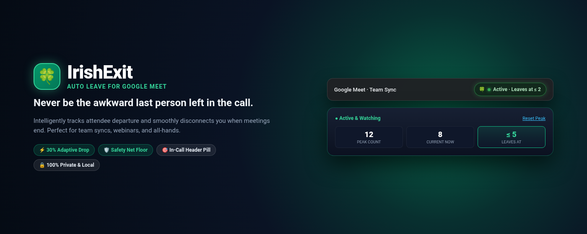
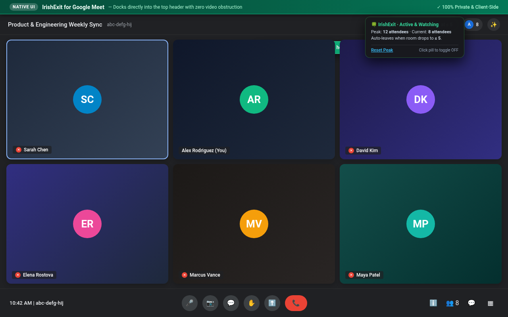
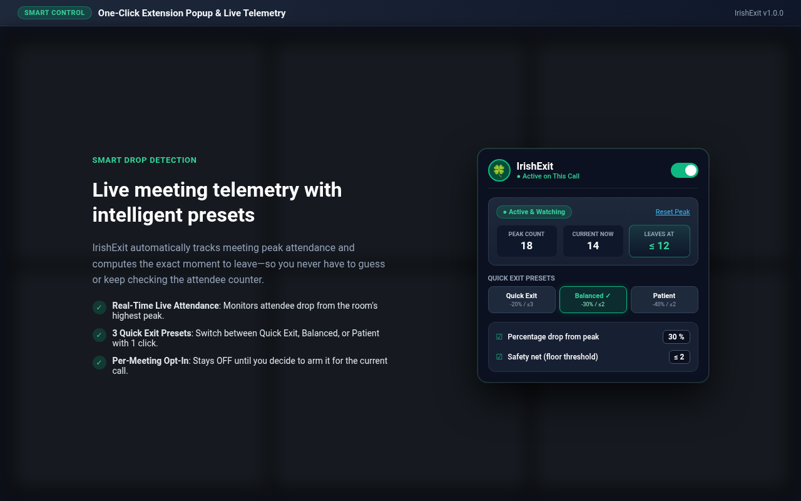
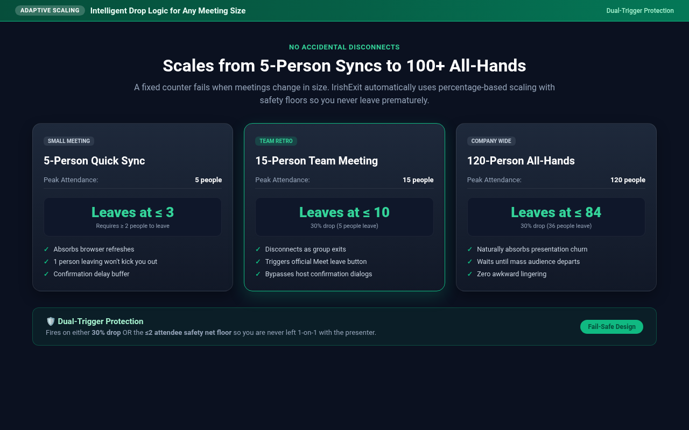
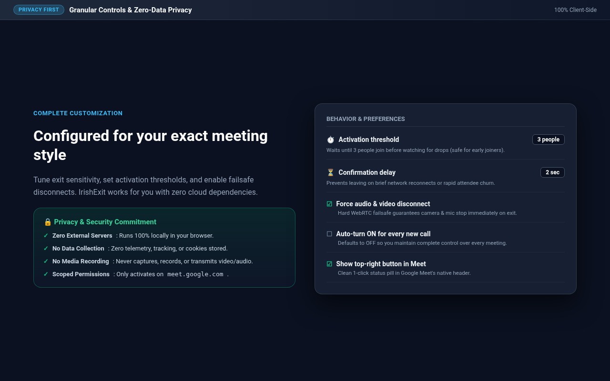

# IrishExit — Auto Leave for Google Meet

**Never be the awkward last person left lingering in an empty meeting.**

📖 **[Full Documentation](HOW_IT_WORKS.md)** • 🔒 **[Privacy Policy](PRIVACY.md)**

---

## 🍀 Why IrishExit?

When big presentations, team retros, or all-hands finish, attendance collapses fast. If you're multitasking or taking notes, you frequently end up trapped in the meeting room alone with the host or presenter. 

**IrishExit** solves this permanently. It intelligently monitors Google Meet attendance in real time and smoothly disconnects you when people start leaving.

---

## 📸 Extension Preview

### 1. In-Call Header Integration
Sits directly in Google Meet's top-right header with zero interference with Gemini prompts, chat questions, closed captions, or video tiles. Click once to toggle on/off.

---

### 2. Live Telemetry & Instant Presets
Open the extension popup anytime to see live participant metrics, peak attendance, and choose between one-click exit presets.

---

### 3. Adaptive Scaling for Any Meeting Size
Whether you are in a 5-person sync or a 120-person all-hands, percentage-based drop thresholds ensure you never leave prematurely due to normal mid-meeting turnover or browser refreshes.

---

### 4. Granular Preferences & Privacy-First Security
Tune exit delays, configure safety net floors, and enable failsafe disconnects with 100% client-side privacy.

---

## ✨ Core Features

- **Per-Meeting Opt-In (OFF by Default)**:
  - Defaults to **OFF** so IrishExit never interrupts calls you want to stay in until the very end.
  - Arm with a single click using the in-call button in Meet's top-right header or the extension popup.
- **Dual-Trigger Protection**:
  - **Drop % from Peak** (default `30%`): Absorbs normal audience fluctuations while detecting mass departures.
  - **Safety Net Floor** (default `≤ 2` people): Guarantees you never get trapped 1-on-1 with the presenter.
- **Smart Activation Threshold (≥ 3 people)**:
  - Waits until meeting attendees actually arrive before arming, so joining an empty room early won't trigger an exit.
- **3-Layer Guaranteed Hangup**:
  1. Triggers Google Meet's official **Leave call** button.
  2. Bypasses host confirmation dialogs (*"Just leave the call"*).
  3. **Hard WebRTC Disconnect**: Disconnects microphone and camera instantly by navigating to the end screen.

---

## 🛠️ Local Installation (Load Unpacked)

1. Clone or download this repository.
2. Open Chrome and navigate to `chrome://extensions/`.
3. Enable **Developer mode** (toggle in the top-right corner).
4. Click **Load unpacked** (top-left button) and select the `irishexit` folder.
5. Join any Google Meet call and click the clover pill in the top-right header to activate!

---

## 🔒 Privacy & Permissions

IrishExit is designed with a strict zero-data policy:
- **100% Local**: Runs entirely in your browser sandbox.
- **Zero Telemetry**: No external servers, no tracking, no analytics, no third-party scripts.
- **Scoped Host Permissions**: Only activates on `https://meet.google.com/*`.
- **No Media Recording**: Only reads the participant counter element—never captures audio, video, or chat.

---

## 📄 License

Distributed under the MIT License. See `LICENSE` for more information.
